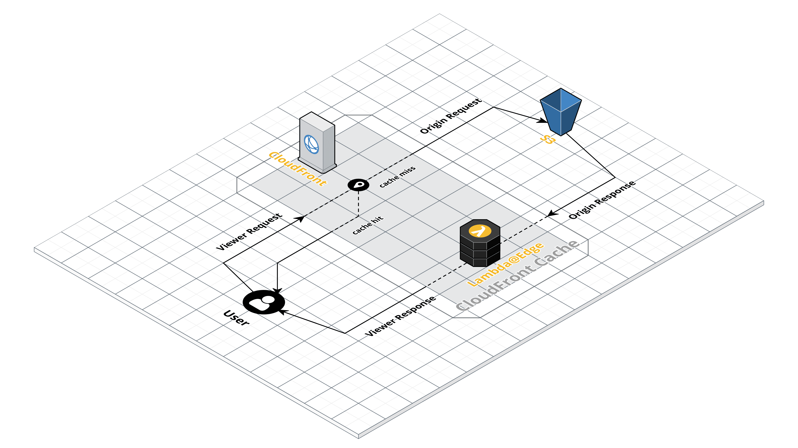

# AWS CloudFront의 Lambda@Edge로 실시간 이미지 리사이즈 구현하기

 

## :book: AWS CloudFront란?

* 빠른 전송 속도로 데이터, 동영상, 애플리케이션 및 API를 전 세계 고객에게 안전하게 전송하는 고속 콘텐츠 전송 네트워크(CDN, Contents Delivery Network) 서비스입니다.

 

## :book: Lambda@Edge란?

* AWS CloudFront의 기능 중 하나로서 애플리케이션의 사용자에게 더 가까운 위치에서 코드를 실행하여 성능을 개선하고 지연 시간을 단축할 수 있게 해 줍니다.

* 전 세계 여러 위치에 있는 인프라를 프로비저닝하거나 관리하지 않아도 됩니다.

    `프로비저닝? 사용자 요구에 맞게 시스템 자원을 할당, 배치, 배포해두었다가 필요시 시스템을 즉시 사용할 수 있는 상태로 준비해 두는 것을 말합니다.`

* AWS CloudFront에 의해 생성된 이벤트에 대한 응답으로 코드를 실행합니다.

 

## :book: Image-Resize 구성도

 

## :bookmark: 참고

* [AWS CloudFront](https://aws.amazon.com/ko/cloudfront/)

* [AWS Lambda@Edge](https://aws.amazon.com/ko/lambda/edge/)